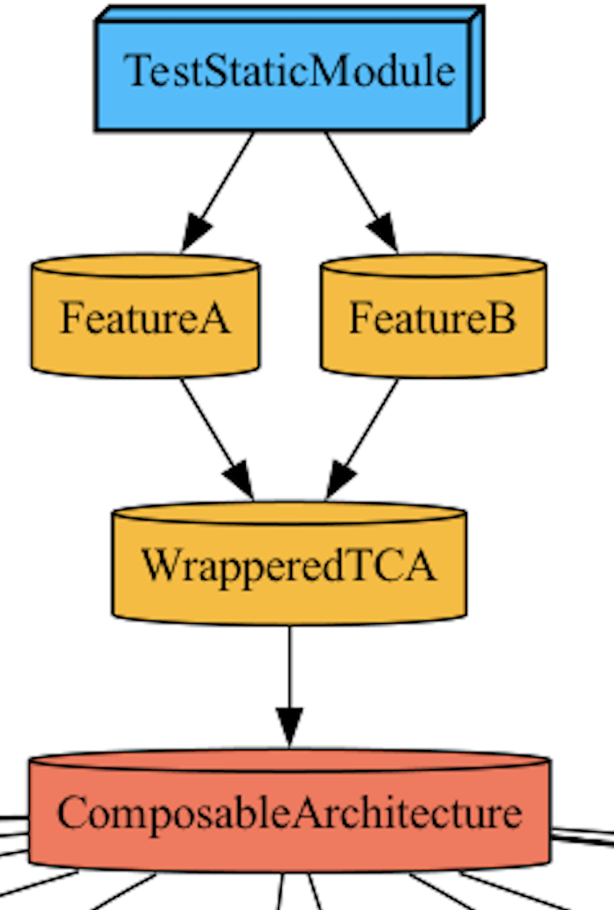

# **📌 Multi-Module TCA with Tuist & SwiftUI Preview**



## **📖 프로젝트 개요**
이 프로젝트는 **Tuist를 활용한 다중 모듈 아키텍처**에서 **Composable Architecture(TCA)** 및 **SwiftUI Preview**를 지원하도록 구성된 샘플 프로젝트입니다.  
특히 **Preview 환경에서도 정상적으로 동작할 수 있도록 `Dynamic Framework`를 활용**하여, 정적 프레임워크에서 발생하는 미리보기 이슈를 해결합니다.

---

## **📂 프로젝트 구조**
### **🛠️ 주요 모듈 및 의존성 관계**
```
TestStaticModule
├── FeatureA  (🔹 Dynamic Framework)
├── FeatureB  (🔹 Dynamic Framework)
├── WrapperedTCA  (🔹 Dynamic Framework, ✅ TCA 직접 의존성)
└── ComposableArchitecture (🟠 Static Library)
```
- **FeatureA, FeatureB, WrapperedTCA** → **Dynamic Framework**로 선언  
- **WrapperedTCA만 `ComposableArchitecture`에 직접 의존**  
  - 이를 통해 **FeatureA, FeatureB는 `WrapperedTCA`를 통해 간접적으로 TCA를 활용**  

---

## **🔍 프로젝트의 핵심 목표**
✅ **Tuist를 활용한 다중 모듈 관리**  
✅ **Composable Architecture(TCA) 적용**  
✅ **SwiftUI Preview가 정상적으로 동작하도록 설정**  
✅ **Static Library와 Dynamic Framework 간 의존성 관리 최적화**  

---

## **⚙️ Tuist 설정**
### ** 주요 Tuist 설정**
- `FeatureA`, `FeatureB`, `WrapperedTCA`를 **Dynamic Framework로 설정**
- `WrapperedTCA`는 `ComposableArchitecture`(TCA)를 직접 포함  
- `productTypes`에서 `.framework`를 지정하여 Preview 지원  

```swift
let packageSettings = PackageSettings(
    productTypes: [
        "ComposableArchitecture": .framework,  //  동적 프레임워크 설정
        "Dependencies": .framework,
        "CombineSchedulers": .framework
    ]
)
```


## **🚀 프로젝트 실행 방법**
1. Tuist 설치
    [tuist documents 참고](https://docs.tuist.io/guides/quick-start/install-tuist)
2. Git clone 
3. 터미널에서 클론 받은 경로로 이동 후 tuist install 실행
4. tuist generate로 프로젝트 생성  
5. 생성된 xcworkspace 실행

